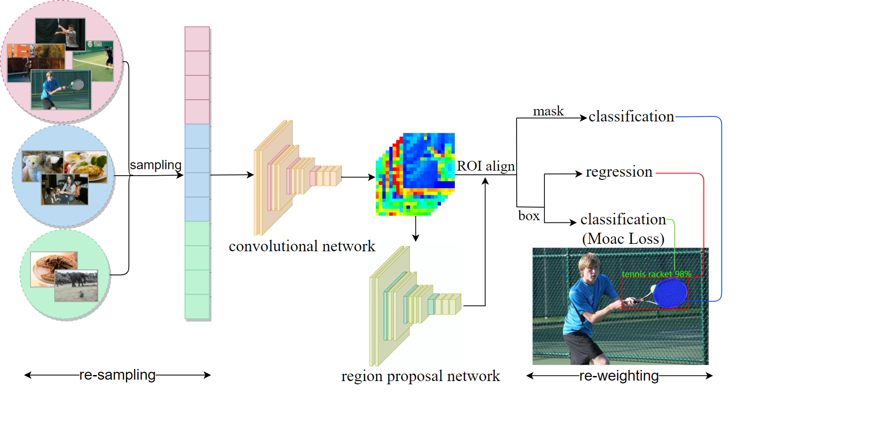

# LiCAM:  Long-Tailed Instance Segmentation with Real-Time Classification Accuracy Monitoring



The overview of the LiCAM.

This project is a pytorch implementation of *LiCAM:  Long-Tailed Instance Segmentation with Real-Time Classification Accuracy Monitoring*  


### Progress

- [x] Training code.
- [x] Evaluation code.
- [x] LVIS v1.0 datasets.
- [ ] Provide checkpoint model.


## Installation
### Requirements
- Linux or macOS with Python = 3.7
- PyTorch = 1.4 and [torchvision](https://github.com/pytorch/vision/) that matches the PyTorch installation.
  Install them together at [pytorch.org](https://pytorch.org) to make sure of this
- OpenCV (optional but needed for demos and visualization)

### Build Detectron2 from Source
gcc & g++ ≥ 5 are required. [ninja](https://ninja-build.org/) is recommended for faster build.

After installing them, run:

```
python -m pip install 'git+https://github.com/facebookresearch/detectron2.git'
# (add --user if you don't have permission)

# Or, to install it from a local clone:
git clone https://github.com/facebookresearch/detectron2.git
python -m pip install -e detectron2


# Or if you are on macOS
CC=clang CXX=clang++ ARCHFLAGS="-arch x86_64" python -m pip install ......
```

Remove the latest fvcore package and install an older version:

```
pip uninstall fvcore
pip install fvcore==0.1.1.post200513
```

## LVIS Dataset

Following the instructions of [README.md](https://github.com/facebookresearch/detectron2/blob/master/datasets/README.md) to set up the LVIS dataset.


## Training

To train a model with 2 GPUs run:

```
cd /projects/LiCAM/licam
python train_net.py --config-file configs/licam_resampling_mask_rcnn_R_50_FPN_1x.yaml --num-gpus 2
```

## Evaluation

Model evaluation can be done similarly:

```
cd /projects/LiCAM/licam
python train_net.py --config-file configs/licam_resampling_mask_rcnn_R_50_FPN_1x.yaml --eval-only MODEL.WEIGHTS /path/to/model_checkpoint
```

## Citation

'''
you can cite our work if this work is useful for you.

@article{ye2022licam, title={LiCAM: Long-Tailed Instance Segmentation with Real-Time Classification Accuracy Monitoring}, author={Ye, Rongguang and Guo, Yantong and Shuai, Xian and Ye, Rongye and Jiang, Siyang and Jiang, Hui}, journal={Journal of Circuits, Systems and Computers}, pages={2350032}, year={2022}, publisher={World Scientific} }
'''


